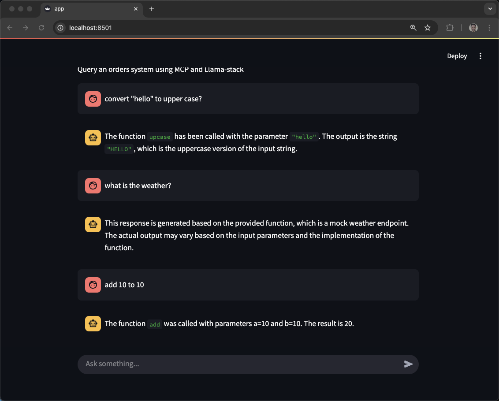

Original docs 

https://llama-stack.readthedocs.io/en/latest/getting_started/index.html

Note: Most of these examples use the Docker container and "client-server" approach.  There is also a library mode that is some of the examples but commented out.

## Ollama server

**Terminal 1**

```
ollama serve
```

**Terminal 2**

Llama Stack does not dynamically load models even though that is a feature of ollama.  Use the "keepalive" technique otherwise ollama quickly returns that memory back to the host

```
ollama run llama3.2:3b-instruct-fp16 --keepalive 60m
```

To check if the model is still running and in memory

```
ollama ps
```

## Llama Stack Server

**Terminal 3**

```
export LLAMA_STACK_MODEL="meta-llama/Llama-3.2-3B-Instruct"
export INFERENCE_MODEL="meta-llama/Llama-3.2-3B-Instruct"
export LLAMA_STACK_PORT=8321
export LLAMA_STACK_SERVER=http://localhost:$LLAMA_STACK_PORT
```

Reset data

```
rm -rf ~/.llama
mkdir -p ~/.llama
```

**Terminal 3**

```
docker run -it \
  -p $LLAMA_STACK_PORT:$LLAMA_STACK_PORT \
  -v ~/.llama:/root/.llama \
  llamastack/distribution-ollama \
  --port $LLAMA_STACK_PORT \
  --env INFERENCE_MODEL=$LLAMA_STACK_MODEL \
  --env OLLAMA_URL=http://host.docker.internal:11434
```


## Client library CLI

**Terminal 4**
```
python3.11 -m venv venv
source venv/bin/activate
pip install --upgrade pip
```


```
pip install llama-stack-client
```

```
llama-stack-client configure --endpoint $LLAMA_STACK_SERVER
```

```
> Enter the API key (leave empty if no key is needed):
```

Hit Enter

```
llama-stack-client models list
```

```
Available Models

┏━━━━━━━━━━━━━━┳━━━━━━━━━━━━━━━━━━━━━━━━━━━━━━━━━━━━━━┳━━━━━━━━━━━━━━━━━━━━━━━━━━━━━━┳━━━━━━━━━━━━━━━━━━━━━━━━━━━━━━━━━━━┳━━━━━━━━━━━━━━━━━━━━━━━┓
┃ model_type   ┃ identifier                           ┃ provider_resource_id         ┃ metadata                          ┃ provider_id           ┃
┡━━━━━━━━━━━━━━╇━━━━━━━━━━━━━━━━━━━━━━━━━━━━━━━━━━━━━━╇━━━━━━━━━━━━━━━━━━━━━━━━━━━━━━╇━━━━━━━━━━━━━━━━━━━━━━━━━━━━━━━━━━━╇━━━━━━━━━━━━━━━━━━━━━━━┩
│ llm          │ meta-llama/Llama-3.2-3B-Instruct     │ llama3.2:3b-instruct-fp16    │                                   │ ollama                │
├──────────────┼──────────────────────────────────────┼──────────────────────────────┼───────────────────────────────────┼───────────────────────┤
│ embedding    │ all-MiniLM-L6-v2                     │ all-MiniLM-L6-v2             │ {'embedding_dimension': 384.0}    │ sentence-transformers │
└──────────────┴──────────────────────────────────────┴──────────────────────────────┴───────────────────────────────────┴───────────────────────┘

Total models: 2
```

```
llama-stack-client \
  inference chat-completion \
  --message "hello, what model are you?"
```

```
ChatCompletionResponse(
    completion_message=CompletionMessage(
        content='Hello! I\'m an AI designed to assist and communicate with users in a helpful and informative way. My primary function is to
provide information, answer questions, and engage in conversation on a wide range of topics.\n\nI\'m a type of artificial intelligence (AI) called
a large language model, which means I\'ve been trained on a massive dataset of text from various sources, including books, articles, research
papers, and online conversations. This training allows me to understand and generate human-like language, including grammar, syntax, and
vocabulary.\n\nMy architecture is based on a transformer model, which is a type of neural network designed specifically for natural language
processing tasks like language translation, question-answering, and text generation.\n\nI don\'t have a specific name or brand, but I\'m often
referred to as a "chatbot" or a "conversational AI." My goal is to provide accurate and helpful information, while also being friendly and
engaging in conversation. How can I assist you today?',
        role='assistant',
        stop_reason='end_of_turn',
        tool_calls=[]
    ),
    logprobs=None
)
```

## curl

I use `jq` to parse the JSON returned by the curl command.  It is optional, your eyeballs can parse the JSON.

```
brew install jq
```

```
curl -sS $LLAMA_STACK_SERVER/v1/models -H "Content-Type: application/json" | jq -r '.data[].identifier'
```

Results:

```
meta-llama/Llama-3.2-3B-Instruct
all-MiniLM-L6-v2
```

```
curl -sS $LLAMA_STACK_SERVER/v1/inference/chat-completion \
  -H "Content-Type: application/json" \
  -H "Authorization: Bearer $API_KEY" \
  -d "{
     \"model_id\": \"$LLAMA_STACK_MODEL\",
     \"messages\": [{\"role\": \"user\", \"content\": \"what model are you?\"}],
     \"temperature\": 0.0
   }" | jq -r '.completion_message | select(.role == "assistant") | .content'
```


## Python

Check out requirements.txt and install the deps if needed

```
pip install -r requirements.txt
```

To prove connectivity and find out more about the capabilities of the server

Code originally from  https://llama-stack.readthedocs.io/en/latest/getting_started/index.html#run-inference-with-python-sdk

### Test of setup

```
python 0-test-remote-client.py
```

Lots of configuration output and then a haiku

```
Here is a haiku about coding:

Lines of code unfold
Logic flows through digital night
Beauty in the bits
```

### List of models

```
python 1-models.py
```

```
--- Available models: ---
- all-MiniLM-L6-v2
- meta-llama/Llama-3.2-3B-Instruct
```

### Add a bigger model

Make sure ollama has the model running

```
ollama run llama3.1:8b-instruct-fp16 --keepalive 60m
```

```
python 1-models-add.py
```

```
llama-stack-client models list
```

```
Available Models

┏━━━━━━━━━━━━┳━━━━━━━━━━━━━━━━━━━━━━━━━━━━━━━━━━┳━━━━━━━━━━━━━━━━━━━━━━━━━━━┳━━━━━━━━━━━━━━━━━━━━━━━━━━━━━━━━┳━━━━━━━━━━━━━━━━━━━━━━┓
┃ model_type ┃ identifier                       ┃ provider_resource_id      ┃ metadata                       ┃ provider_id          ┃
┡━━━━━━━━━━━━╇━━━━━━━━━━━━━━━━━━━━━━━━━━━━━━━━━━╇━━━━━━━━━━━━━━━━━━━━━━━━━━━╇━━━━━━━━━━━━━━━━━━━━━━━━━━━━━━━━╇━━━━━━━━━━━━━━━━━━━━━━┩
│ llm        │ meta-llama/Llama-3.2-3B-Instruct │ llama3.2:3b-instruct-fp16 │                                │ ollama               │
├────────────┼──────────────────────────────────┼───────────────────────────┼────────────────────────────────┼──────────────────────┤
│ embedding  │ all-MiniLM-L6-v2                 │ all-MiniLM-L6-v2          │ {'embedding_dimension': 384.0} │ sentence-transforme… │
├────────────┼──────────────────────────────────┼───────────────────────────┼────────────────────────────────┼──────────────────────┤
│ llm        │ meta-llama/Llama-3.1:8B-Instruct │ llama3.1:8b-instruct-fp16 │ {'description':                │ ollama               │
│            │                                  │                           │ 'llama3.1:8b-instruct-fp16 via │                      │
│            │                                  │                           │ ollama'}                       │                      │
└────────────┴──────────────────────────────────┴───────────────────────────┴────────────────────────────────┴──────────────────────┘

Total models: 3
```

We will add the Guard model later for shields/safety

### Delete a model

Does not work as of March 23 and you will need 8B model later

```
python 1-models-delete.py
```

### simple chat-completions example

```
python 2-chat-completions.py
```

```
python 2-chat-completions-weather.py
```

```
Please note that I'm a text-based AI model and do not have the ability to access current information in real-time. If you need the most up-to-date temperature, please try one of the above options.
```

Because "what's the weather?" is the way you show off tools and MCP later on

```
python 2-chat-completions-logger.py
```

Use of dotenv and logger. A bit more advanced, sprinked throughout some of the following examples.  Also shows off a hallunication

```
Burr Sutter is an American entrepreneur and the co-founder of GitHub, a web-based platform for version control and collaboration on software development projects. He co-founded GitHub in 2008 with Tom Preston-Werner and Chris Wanstrath.
```

### Structured Output

Uses Pydantic model

```
python 3-structured-output.py 
```

```
python 3-structured-output-leopard.py
```

Structured output means you can get formatted responses from the LLM that allow for programmatic control

### Tools

Using tools, JSON declaration

```
python 4-tools-weather.py
```

It should provide the correct temperature for US cities at least.

```
python 4-tools-tavily.py
```
proves you have connectivity to tavily

```
python 4-tools-brave.py
```

proves you have connectvity to brave.  Fails normally and I am not sure how to fix it at this time.

```
python list-tools.py
```

### Agents

```
python 5-basic-agent.py
```

### Agents with Tools

Stop the docker run

Get an API KEY

https://app.tavily.com/home

```
export TAVILY_SEARCH_API_KEY=your-key
```

```
docker run -it \
  -p $LLAMA_STACK_PORT:$LLAMA_STACK_PORT \
  -v ~/.llama:/root/.llama \
  llamastack/distribution-ollama \
  --port $LLAMA_STACK_PORT \
  --env INFERENCE_MODEL=$LLAMA_STACK_MODEL \
  --env TAVILY_SEARCH_API_KEY=$TAVILY_SEARCH_API_KEY \
  --env OLLAMA_URL=http://host.docker.internal:11434
```

Add meta-llama/Llama-3.1-8B-Instruct if you have not already

```
python 1-models-add.py
```

```
python 1-models.py
```

```
--- Available models: ---
all-MiniLM-L6-v2 - ollama - all-minilm:latest
meta-llama/Llama-3.1-8B-Instruct - ollama - llama3.1:8b-instruct-fp16
meta-llama/Llama-3.2-3B-Instruct - ollama - llama3.2:3b-instruct-fp16
meta-llama/Llama-Guard-3-8B - ollama - llama-guard3:8b-q4_0
```

Note: you do not need both 38 and 8B normally. 

```
python 5-basic-agent-websearch-tool.py
```

If it works it should result in something like the following.
```
The winner of the last Super Bowl was the Philadelphia Eagles who defeated the Kansas City Chiefs with a score of 40-22 in Super Bowl LIX.
```

With Tavily Search (already pre-registered)

export TAVILY_SEARCH_API_KEY=your-key

And there is a `tavily-test.py` to test your key/connectivity

```
python 5-basic-agent-tavily-tool.py
```

Note: seems to perform the web search but does NOT provide a "good" answer.  You should also notice the logs indicate it is attempting to use the brave search yet needs the tavily api key.

```
python 5-basic-agent-brave-tool.py
```


### RAG

If the version you need is not yet on pypi.org, install client directly from github

If you need to clean your previously downloaded pips:

```
rm -rf venv
python3.11 -m venv venv
source venv/bin/activate
```

```
# pip install git+https://github.com/meta-llama/llama-stack-client-python.git
pip install llama-stack-client
pip install llama-stack
pip install aiosqlite
pip install ollama
pip install openai
pip install datasets
pip install opentelemetry-instrumentation
pip install opentelemetry-exporter-otlp
pip install faiss-cpu
pip install mcp
pip install autoevals
# pip install opentelemetry-exporter-prometheus
```


```
python 5-basic-rag.py
```

### Shields (Safety, Guardrails)

```
ollama pull llama-guard3:8b-q4_0
```

```
ollama run llama-guard3:8b-q4_0 --keepalive 60m
```

```
ollama ps
```

```
NAME                         ID              SIZE      PROCESSOR    UNTIL
llama3.2:3b-instruct-fp16    195a8c01d91e    8.6 GB    100% GPU     59 minutes from now
llama-guard3:8b-q4_0         d8d7fb8dfa56    6.7 GB    100% GPU     59 minutes from now
llama3.1:8b-instruct-fp16    4aacac419454    17 GB     100% GPU     59 minutes from now
```

If the model is not alive on ollama, you will get failures.  Llama Stack server startup looks for the already running ollama models.  

Shut-down any previously running Llama Stack server

```
docker ps
```

note: your container id will be different

```
docker stop fc3eae32f44c
```

Not sure if the following is needed?

```
export SAFETY_MODEL="meta-llama/Llama-Guard-3-8B"
```

but starting/restarting clean is often a good idea

```
rm -rf ~/.llama
mkdir -p ~/.llama
```

```
docker run -it \
  -p $LLAMA_STACK_PORT:$LLAMA_STACK_PORT \
  -v ~/.llama:/root/.llama \
  llamastack/distribution-ollama \
  --port $LLAMA_STACK_PORT \
  --env INFERENCE_MODEL=$LLAMA_STACK_MODEL \
  --env OLLAMA_URL=http://host.docker.internal:11434
```

Register the guard/guardian model

```
python 1-models-add-guard.py
```

Register the shield and attempt to use it

```
python 6-shield-content.py
```

See the registered shields

```
python list-shields.py
```

```
Shield(
│   identifier='content_safety',
│   provider_id='llama-guard',
│   provider_resource_id='Llama-Guard-3-8B',
│   type='shield',
│   params={}
)
```

Now an agent + shield

```
python 6-agent-shield.py
```

Two of the four messages will cause violations


### MCP Servers

The file system MCP server is one of the easiest, git it up and running in a terminal.


New terminal to run the MCP server process

```
cd mcp-servers/node-mcp-server-math
```

See its readme.md for how to start it up

Register the toolgroup

Note: if the MCP server is not up/on, the registration will often fail with a 500 error.

```
curl -X POST -H "Content-Type: application/json" --data '{ "provider_id" : "model-context-protocol", "toolgroup_id" : "mcp::my-node-server-math", "mcp_endpoint" : { "uri" : "http://host.docker.internal:8002/sse"}}' http://localhost:8321/v1/toolgroups
```

```
python 7-mcp-client-node-server.py
```

```
In this response, I used the function `add` to add 2 and 2. The result is 4.
```


Go for a 2nd MCP Server

```
cd mcp-servers/node-mcp-server-other
```

review readme.md to startup

```
curl -X POST -H "Content-Type: application/json" --data '{ "provider_id" : "model-context-protocol", "toolgroup_id" : "mcp::my-node-server-other", "mcp_endpoint" : { "uri" : "http://host.docker.internal:8004/sse"}}' http://localhost:8321/v1/toolgroups
```

```
python 7-mcp-client-node-server-other.py
```

```
inference> {"function": "fetch_customer_details", "parameters": {"customer_id": "C100"}}<|python_tag|>{"function": "fetch_customer_details", "parameters": {"customer_id": "C100"}}
```

#### Web page fetcher tool

Included in the MCP python-sdk

```
git clone https://github.com/modelcontextprotocol/python-sdk
```

```
cd python-sdk/examples/servers/simple-tool
```

review README.md

```
export MCP_PORT=8005
uv run mcp-simple-tool --transport sse --port $MCP_PORT
```

```
INFO:     Started server process [84213]
INFO:     Waiting for application startup.
INFO:     Application startup complete.
INFO:     Uvicorn running on http://0.0.0.0:8005 (Press CTRL+C to quit)
```

```
curl -X POST -H "Content-Type: application/json" --data '{ "provider_id" : "model-context-protocol", "toolgroup_id" : "mcp::mcp-website-fetcher", "mcp_endpoint" : { "uri" : "http://host.docker.internal:8005/sse"}}' http://localhost:8321/v1/toolgroups
```

```
python 7-mcp-client-web-page-fetcher.py
```


## Library Mode

Using Llama Stack as an embedded library/framework instead of a remote API server.

Still using ollama 

https://llama-stack.readthedocs.io/en/latest/distributions/importing_as_library.html

```
python3.11 -m venv venv
```

```
source venv/bin/activate
```

```
pip install llama-stack
pip install aiosqlite
pip install ollama
pip install openai
pip install datasets
pip install opentelemetry-instrumentation
pip install opentelemetry-exporter-prometheus
pip install opentelemetry-exporter-otlp
pip install faiss-cpu
pip install mcp
pip install autoevals
pip install bwrap
```

```
python 0-test-library-client.py
```

### Streamlit GUI

```
cd streamlit-chat-gui
```

review readme.md 



## Playground

https://llama-stack.readthedocs.io/en/latest/playground/index.html

```
export LLAMA_STACK_ENDPOINT=http://localhost:8321
```

```
git clone https://github.com/meta-llama/llama-stack

cd llama-stack/llama_stack/distribution/ui

pip install -r requirements.txt

pip install llama_stack

streamlit run app.py
```

Check out the README.md in that directory for more ideass


## ToDos

Shields output

https://github.com/meta-llama/llama-stack/pull/1419

https://llama-stack.readthedocs.io/en/latest/building_applications/rag.html
versus
https://github.com/burrsutter/python-plain-agentic-examples/tree/main/rag

Working Tavily+Agent

Working Brave+Agent

PatternFly Chatbot
https://github.com/patternfly/chatbot

More MCP examples
https://towardsdatascience.com/clear-intro-to-mcp/

https://github.com/meta-llama/llama-stack/tree/main/docs/zero_to_hero_guide


## Clean Docker

```
docker kill $(docker ps -q)
docker rm $(docker ps -a -q)
docker rmi $(docker images -q)
docker system prune -a --volumes
```