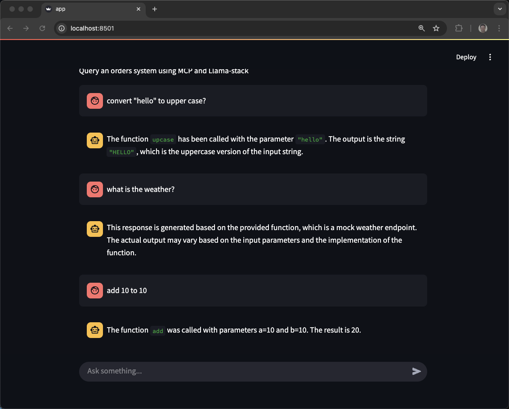

```
python3.11 -m venv venv
source venv/bin/activate
```

```
pip install -r requirements.txt
```

Check connectivity and registered models on Llama Stack

```
curl -sS http://localhost:8321/v1/models | jq
```

```
{
  "data": [
    {
      "identifier": "meta-llama/Llama-3.2-3B-Instruct",
      "provider_resource_id": "llama3.2:3b-instruct-fp16",
      "provider_id": "ollama",
      "type": "model",
      "metadata": {},
      "model_type": "llm"
    },
    {
      "identifier": "all-MiniLM-L6-v2",
      "provider_resource_id": "all-minilm:latest",
      "provider_id": "ollama",
      "type": "model",
      "metadata": {
        "embedding_dimension": 384
      },
      "model_type": "embedding"
    },
    {
      "identifier": "meta-llama/Llama-3.1-8B-Instruct",
      "provider_resource_id": "llama3.1:8b-instruct-fp16",
      "provider_id": "ollama",
      "type": "model",
      "metadata": {
        "description": "llama3.1:8b-instruct-fp16 via ollama"
      },
      "model_type": "llm"
    }
  ]
}
```

Check on registered tools

```
curl -sS http://localhost:8321/v1/toolgroups | jq
```


```
export LLAMA_STACK_SERVER=http://localhost:8321
export LLAMA_STACK_MODEL=meta-llama/Llama-3.1-8B-Instruct
```

```
streamlit run app.py
```



